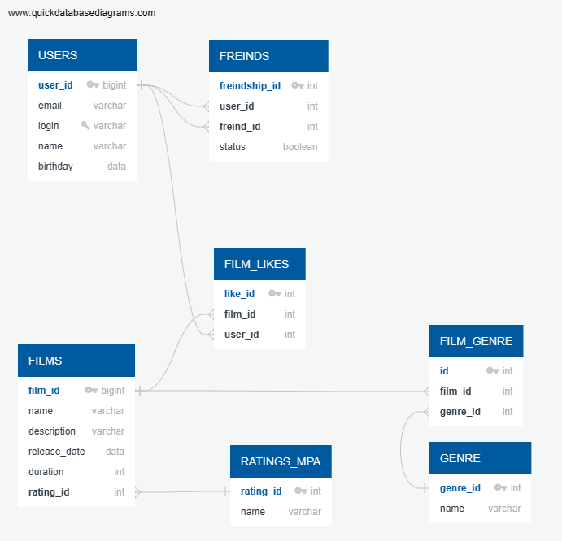

# java-filmorate

## Модель базы данных (ER-диаграмма)

### Примеры запросов в базу данных

###### Получить фильм с id=1

    SELECT *
    FROM films
    WHERE film_id = 1;

###### Получить пользователя с id=1

    SELECT *
    FROM users
    WHERE user_id = 1;

